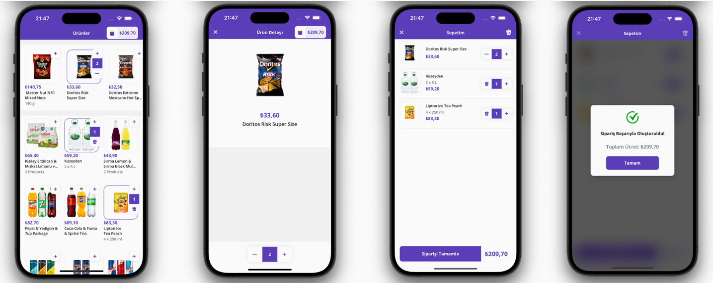
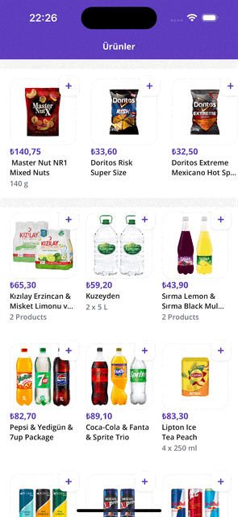
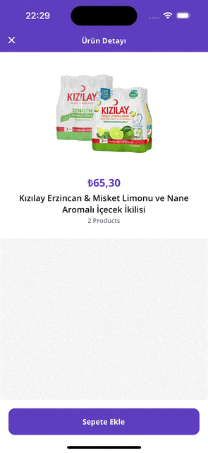
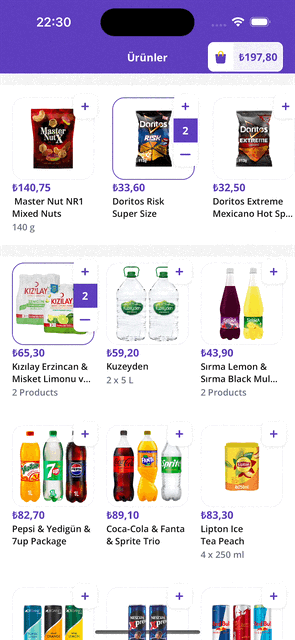

# Getir Lite

## About the Project
This project is the final project of the Getir iOS Swift Bootcamp organized in cooperation with [Patika.dev](https://www.patika.dev) and [Getir](https://getir.com). In the project, which is a lite version of the Getir application, certain features of the Getir application were imitated.

The aim of the project is to develop an application that allows the user to view the products in the mock api response in a list and add/remove any of them to/out of the cart.

## Key Features

### Product Listing
- **Description**: The app fetches and displays product data from mock APIs, featuring a horizontal scrollable list for products and a vertical list for product details. Users can navigate to detailed product views by clicking on items in the list.

 

- **Product Listing Screen GIF**:

### Product Details
- **Description**: Displays detailed information including the product's image, name, price, description, and current amount in the cart. Users can update product quantities using a stepper control and save changes.

 

- **Product Details Screen GIF**:

### Shopping Cart
- **Description**: Users can view all items in their cart with individual counts. Features include updating quantities, checking out with a success message that shows the total cart amount, and resetting local data post-checkout. Navigation to the cart screen is disabled if the cart is empty.

 

- **Cart Screen GIF**:

## Tech Stack

- Xcode Version: 15.3
- Language: Swift 5
- iOS Version: iOS 14.0
- UI Framework: UIKit

## Third Party Dependencies

- [Moya](https://github.com/Moya/Moya) for network requests
- [SnapKit](https://github.com/SnapKit/SnapKit) for programmatic UI auto layout
- [Kingfisher](https://github.com/onevcat/Kingfisher) for image loading

## Architecture

### MVC Pattern
For the project, the Model-View-Controller (MVC) architectural pattern has been adopted. This structure is aimed at separating the concerns within the application to promote an organized codebase and improve maintainability.

### Delegate Pattern
The delegate pattern is employed to facilitate data transfer between screens, maintaining the separation of concerns essential to the MVC architecture. Data and events are passed between the product listing, product details, and shopping cart screens through delegated responsibilities. This approach allows each screen to handle its specific user interactions and UI updates independently, enhancing the application’s modularity and maintainability.

## Rationale for Dependency Selection

Below are the reasons for choosing each of the third-party dependencies utilized in the project:

- ### Moya
Moya was chosen for its ability to abstract the details of network requests into a simple, declarative syntax. This encapsulation aids in making API calls cleaner and more manageable, aligning well with clean architecture principles by keeping networking code decoupled from the rest of the application.

- ### SnapKit
SnapKit is used for its DSL to make Auto Layout constraints more readable and easier to write in Swift. It simplifies the management of UI code, especially when dealing with dynamic view adjustments, thus enhancing code clarity and reducing potential errors in layout design.

- ### Kingfisher
Kingfisher was selected for its powerful and efficient image downloading and caching capabilities. It significantly simplifies the process of fetching, caching, and displaying images from the web, ensuring smooth and performant image handling in the user interface.

## Networking Approach

The app uses a singleton pattern with Moya to manage network requests efficiently. This approach centralizes network operations through a single, shared instance of the network manager, enhancing consistency and reusability.

## Custom Views

Custom views were incorporated into the project to enhance the project's modularity and reusability. Each component was specifically designed to meet particular needs and functionalities, such as the Add to Cart button with stepper, which was used in various forms across different screens in the project. This not only facilitates consistency in user interface design but also simplifies maintenance by allowing the same custom view to be adapted and reused wherever needed, enhancing the overall flexibility of the application.

## Conclusion

As a developer who began the bootcamp with only basic Swift knowledge, the intensive 5-week bootcamp provided by the Patika and Getir has been immensely beneficial. I am thrilled with the substantial progress I made in such a short period. Throughout the development of the project, my aim was not only to meet all the requirements but also to deliver a production-ready project that adheres to principles of modularity and clean code.

Despite starting with just a foundational knowledge of Swift and having developed some basic apps, my background in computer engineering and the invaluable insights gained during this enriching bootcamp allowed me to complete the project successfully. **Given the opportunity, I am confident that I can further enhance my skills and contribute even more effectively to the Getir's goals.**
